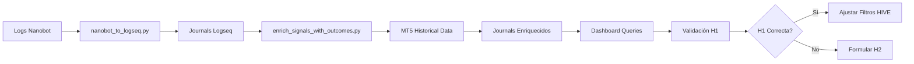

# 🚀 Logseq Enrichment System - Quick Start

**Sistema de análisis cuantitativo para validar hipótesis de trading**

---

## ⚡ Ejecución Inmediata

### 1. Enriquecimiento con MT5 (Primera Vez)

**Prerequisitos**:
- MetaTrader 5 abierto y conectado
- Datos históricos disponibles para 10 símbolos

**Comando**:
```bash
cd /Users/danielsuarezsucre/TRADING/trading_agent
python3 scripts/enrich_signals_with_outcomes.py
```

**Tiempo estimado**: ~10 minutos (51 señales)

**Verificación**:
```bash
grep "simulated_outcome::" ~/Desktop/Nanobot-Logseq/journals/2026_02_16.md | head -5
```

Deberías ver:
```
    simulated_outcome:: TP
    simulated_pnl:: $125.50
    hours_to_exit:: 6.5
```

---

### 2. Abrir Dashboard en Logseq

1. **Abrir Logseq** → Add new graph
2. **Seleccionar** `~/Desktop/Nanobot-Logseq`
3. **Navegar** a [[Nanobot_Dashboard]]
4. **Ejecutar** primera query de H1

---

### 3. Validar Hipótesis H1

**Query 1 - ADX Marginal (15-18)**:
```clojure
{{query (and (property status hive_passed) (property adx) [[>= adx 15]] [[<= adx 18]])}}
```

**Query 2 - ADX Fuerte (>20)**:
```clojure
{{query (and (property status hive_passed) (property adx) [[> adx 20]])}}
```

**Análisis**:
- Contar cuántas tienen `simulated_outcome:: TP` vs `SL`
- Calcular Win Rate = TP / (TP + SL)
- Comparar ambos grupos

**Si H1 es correcta** (ADX marginal < ADX fuerte):
→ Subir umbral ADX de 15 a 18 o 20 en `run_ftmo_manual.py`

---

### 4. Configurar Automatización (Opcional)

**Instalación de cron**:
```bash
chmod +x scripts/auto_export_logseq.sh
crontab -e
```

**Añadir línea** (ejecuta diariamente a las 00:05):
```
5 0 * * * /Users/danielsuarezsucre/TRADING/trading_agent/scripts/auto_export_logseq.sh
```

**Verificar log**:
```bash
tail -f ~/logseq_auto_export.log
```

---

## 📊 Queries Útiles

### Ver todas las señales HIVE Passed con outcomes
```clojure
{{query (and (property status hive_passed) (property simulated_outcome))}}
```

### Señales ganadoras (TP)
```clojure
{{query (property simulated_outcome TP)}}
```

### Señales perdedoras (SL)
```clojure
{{query (property simulated_outcome SL)}}
```

### Kelly Skip que habrían ganado
```clojure
{{query (and (property status kelly_skip) (property simulated_pnl) [[> simulated_pnl 0]])}}
```

### Top símbolos por PnL
```clojure
{{query (page [[BTCUSD]])}}
{{query (page [[GBPUSD]])}}
{{query (page [[AUDUSD]])}}
```

---

## 🔧 Troubleshooting

### Error: "MT5 initialize failed"
- ✅ Verifica que MT5 esté abierto
- ✅ Conecta a servidor (File → Login to Trade Account)
- ✅ Descarga datos históricos (Tools → History Center)

### Error: "DATA_UNAVAILABLE" en outcomes
- Normal para señales muy antiguas (>30 días)
- MT5 puede no tener historial completo
- Solución: Descargar más historial en MT5

### Queries no funcionan en Logseq
- Verifica sintaxis (dobles corchetes [[]])
- Asegúrate de que las propiedades existan
- Prueba query simple primero: `{{query (property status)}}`

---

## 📈 Flujo de Trabajo Completo



---

## 🎯 Métricas a Monitorear

**Después del enriquecimiento**:

| Métrica | Query | Target |
|---------|-------|--------|
| Win Rate General | Count(TP) / Count(TP+SL) | >55% |
| Win Rate ADX >20 | Same, filtered | >60% |  
| Avg Hours to Exit | AVG(hours_to_exit) | <12h |
| False Negatives (Kelly Skip ganadoras) | Count | <10% |

---

## 📚 Documentación Completa

- [Implementation Plan](file:///Users/danielsuarezsucre/.gemini/antigravity/brain/b9f77f40-c7db-465d-b08a-ca9068a69849/implementation_plan.md)
- [Walkthrough](file:///Users/danielsuarezsucre/.gemini/antigravity/brain/b9f77f40-c7db-465d-b08a-ca9068a69849/walkthrough.md)
- [Export Report](file:///Users/danielsuarezsucre/TRADING/trading_agent/LOGSEQ_EXPORT_REPORT.md)

---

**🦖 Sistema Listo - ¡Comienza el Análisis!**
