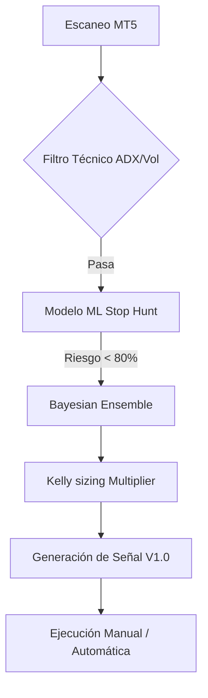

# Arquitectura Técnica Nanobot V1.0

El sistema **Nanobot** está diseñado bajo una arquitectura de capas desacopladas, priorizando la robustez estadística y la gestión de riesgo institucional.

## 🏗️ Estructura de Capas

### 1. Capa de Señal (Hive)
- **Módulo**: `src/nanobot/hive.py`
- **Función**: Generación de señales técnicas basadas en cruces de medias (EMA 9/15/200) alineadas con la tendencia H4.
- **Validación**: Filtros de expansión de volatilidad (ATR) y tendencia (ADX > 15).

### 2. Capa de Inteligencia (ML Model)
- **Módulo**: `src/nanobot/ml_model.py`
- **Función**: Clasificación de setups mediante Random Forest para detectar "Stop Hunts" o trampas de liquidez.
- **Modelo**: `models/stop_hunt_rf_calibrated.joblib` (Calibración Forense Feb 2026).

### 3. Capa de Dimensionamiento (Probability & Kelly)
- **Módulo**: `src/nanobot/kelly_sizing.py`
- **Función**: Cálculo del multiplicador de riesgo basado en la ventaja matemática (f*) y el error estándar de la muestra.
- **Mecánica**: Fractional Kelly (alpha variable) con overlay de protección ante drawdown.

### 4. Capa de Ejecución y Gestión (Risk Manager)
- **Módulo**: `src/nanobot/risk_manager.py`
- **Función**: Cálculo de lotaje, SL dinámico (ATR) y objetivos de TP.
- **Exit Architecture**: 
  - Salida parcial (50%) a 1.3R.
  - Mover a Break-Even automático.
  - Runner al 3.0R final.

### 5. Capa de Auditoría (Tracker)
- **Módulo**: `src/nanobot/trade_tracker.py`
- **Función**: Registro en `data/trades.json` con métricas MAE/MFE para análisis de eficiencia de salida.

---

## 🚦 Flujo de Decisión

